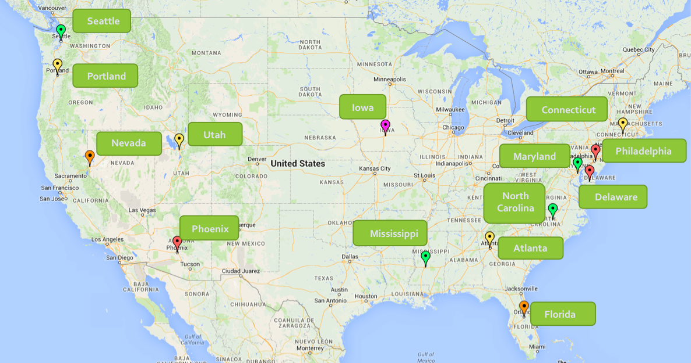

# NeXTA-GMNS
Open-source Network EXplorer for Traffic Analysis (NeXTA) Graphical User Interface for General Modeling Network Specification (GMNS)

####Contact: Dr. Xuesong (Simon) Zhou at Arizona State University.
Email: xzhou74@asu.edu

#What is GMNS?
General Travel Network Format Specification is a product of Zephyr Foundation, which aims to advance the field through flexible and efficient support, education, guidance, encouragement, and incubation.
Further Details in https://zephyrtransport.org/projects/2-network-standard-and-tools/

#Goals of NeXTA development
1. Provide an open-source code base to enable transportation researchers and software developers to expand its range of capabilities to various traffic management application.
2. Present results to other users by visualizing time-varying traffic flow dynamics and traveler route choice behavior in an integrated environment.
3. Provide a free, educational tool for students to understand the complex decision-making process in transportation planning and optimization processes. The lowercase letter "e" in NeXTA stands for education.

#How to use
Latest Software Release 04-20-2020

Step 1: Download software package from "release" folder 

https://github.com/xzhou99/NeXTA-GMNS/tree/master/releases

Use file menu->open to open file node.csv to visualize the simple GMNS Lima sample data set

Step 2: Check out the standard GMNS data sets at

https://github.com/zephyr-data-specs/GMNS/tree/master/Small_Network_Examples/Lima/GMNS

https://github.com/xzhou99/NeXTA-GMNS/tree/master/examples/GMNS_Small_Network_Examples/Lima/GMNS

Step 3: Build your own GMNS data set.

A simple 6-node example with agent files can be found at
https://github.com/xzhou99/NeXTA-GMNS/tree/master/examples/GMNS_AMS_Networks/6-node_network

#Other capabilities of NeXTA

1. Create, edit, store, and visualize transportation network data in GMNS format.

2. Simulation and visuailiing dynamic assignment outputs or sensor data based on file link_performance.csv and agent.csv.

sample data set:
https://github.com/xzhou99/NeXTA-GMNS/tree/master/examples/GMNS_AMS_Networks/Sioux_Falls_network
   
3 NEXTA provides an excellent multi-project management interface with the following features. 

  -  Synchronized display 
  
  -  Compare link moe across different networks 
  
  -  Vehicle path analysis across different simulation results 
  
  
4. NEXTA also can support the  conversion between GIS shape file and user-defined CSV files.
  

## DTALite 
The related open-source software, DTALite, uses a computationally simple but theoretically rigorous traffic queuing model in its lightweight mesoscopic simulation engine. Its built-in parallel computing capability dramatically speeds-up the analysis process by using widely available multi-core CPU hardware. It takes about 1 hour to compute agent-based dynamic traffic equilibrium for a large-scale network with 1 million vehicles for 20 iterations.
https://github.com/xzhou99/dtalite_software_release
- typical network: 2000 traffic zones, 200000 links, 2-10 million vehiches

DTALite/NeXTA applications in the United States

